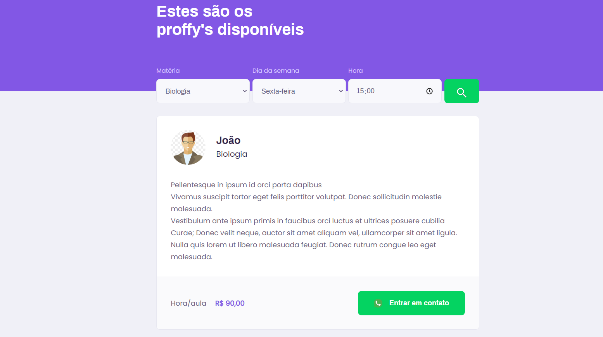
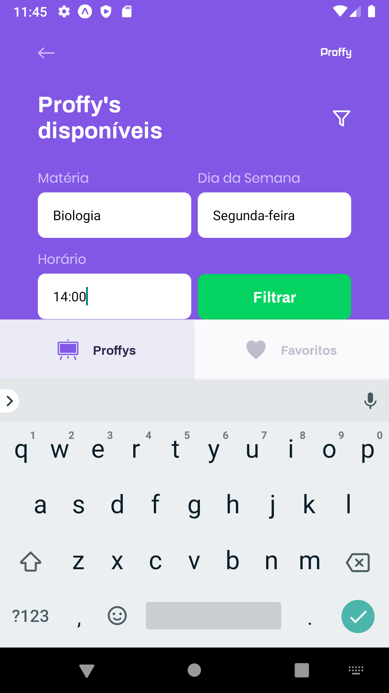

<h1 align="center">
  Proffy
</h1>
</h1>
<h3 align="center">
  <a href="./README.md">English</a> |
  <a href="./README_PT.md">Portuguese</a>
</h3>

## 💻 Project

<h4>
  An app developed with React, React Native and Node to connect students and teachers.  
  Developed during the Next Level Week #2, @Rocketseat 
</h4>
 

  
  
    
  

## 🎨 Layout Web

    
    

## 🎨 Layout Mobile

    
    
    
    

## 💻 Technologies

Technologies used in this project:

- [ReactJS](https://reactjs.org/)
- [React Native](https://reactnative.dev/)
- [Node](https://nodejs.org/en/)
- [TypeScript](https://www.typescriptlang.org/)
- [Expo](https://expo.io/)
- [Axios](https://github.com/axios/axios)
- [Express](https://expressjs.com/)
- [SQLite](https://www.sqlite.org/index.html)

## 🚀 Getting started

First you need to have node and yarn installed on your machine.
Run the following command to clone the project:

1. `git clone https://github.com/carlosdiver/proffy.git`

### 📦 Run API

Inside the server folder run the following command to install dependencies:

2. `yarn install`

To run the server, execute the followin command:

3. `yarn start` 

Keep server running to run web and mobile projects.

### 💻 Run Web Project

Inside the web folder run the following command to install dependencies:

4. `yarn install`

To run web project, execute the followin command:

5. `yarn start` 

### 📱 Run Mobile Project

To run the mobile project install expo app in your smartphone or use an android/ios emulator.
Inside the mobile folder run the following command to install dependencies:

6. `yarn install`

Keep emulator on and run the following commands:

7. `yarn start` or `expo start`

## 📝 License

This project is licensed under the MIT License - see the [LICENSE](LICENSE) file for details.

---

Made with 💙 by Carlos Eduardo Silva <a target="_blank" href="https://www.linkedin.com/in/carlos-silva-devs/">See my Linkedin</a>
